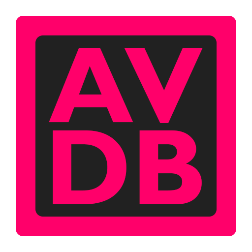

# Adult Video Database
Manage your porn video collection - add performers, tags, websites and have fun!

## Install application (Windows)
To install, run the executable file. You can download the latest executable under "Releases" on the right hand side of this page. After the first launch, go to your "AppData" directory (just write %appdata% in address bar).
Find the folder with the name of this application. The folder "userfiles" should appear in it.
Then you should download archive https://www.gyan.dev/ffmpeg/builds/ffmpeg-release-full.7z
Extract files ffmpeg.exe and ffprobe.exe from folder "bin" in archive and place this files into folder "ffmpeg" in "userfiles". 
Check the right way to files should be "C:\Users\UserName\AppData\Roaming\AVDB\userfiles\ffmpeg\".
And now you can scan videos from application! It's all.

### Portable version
After the first launch, a folder "userdata" will be created in the folder with the executable file. Also need to copy files ffmpeg.exe and ffprobe.exe to the folder "userdata\userfiles\ffmpeg\"

### Linux and macOS support
If you are a developer, it may not be difficult for you to adapt the application for other operating systems. 
The application is made on electron. Paths should be responsive to the operating system. It remains to correctly add ffmpeg files that are needed to create a preview. 
Perhaps if there are a lot of people willing, I will port it for these systems.

## Features

#### App
- Video player with time markers (New!)
- Tabs for easy browsing
- Password protection
- Backup management
- Customizing colors, fonts
- Dark theme
- Statistics about tags, websites (later video statistics will be added)
- Hover card label preview
- Checking for updates on start
- Optimized for one-handed use :)

#### Videos
- Playlists (New!)
- Video preview with image grid 3x3 (New!)
- Adding performers, tags, websites, rating, favorite, bookmark
- Sorting and filtering by performers, tags, websites, filesize, quality, folder, path etc.
- Save filters and sorting to a preset that can be loaded at any time or set as default
- Play video in app (supported format only*) or in the system player selected by default
- Scanning for videos in multiple folders. Information is automatically added to the video: performers, tags, websites
- Video preview on hover (supported format only*)
- Detailed video information: filesize, duration, dimension, quality, filename, format, date added
- Creating video preview manually
- Replacing thumb for a video 
- Add markers to the video (supported format only*): tag, favorite, bookmark
- Play video from a marker in the system player (Media Player Classic only)
- Change paths of the videos
- Filesize of selected and all videos in the status bar
- ... and more

#### Performers
- Adding tags, rating, favorite, bookmark
- Detailed profile: aliases, category, career, age, country and many appearance parameters
- Autosearch for information on the Internet and import data (Freeones, IAFD)
- Sorting and filtering by all profile parameters
- Save filters and sorting to a preset that can be loaded at any time or set as default
- Ability to set 4 images for each (main, alternate, 2 custom), avatar, header image on the performer page
- Beautiful performer page with descriptive profile information. Filtration of videos with a performer by tags from the video. A meter that is determined by the values of tags from the video.
- Adding several at a time
- Profile completion progress
- Edit performer info parameters in settings (the ability to add new parameters will be added later) 
- ... and something else

#### Tags
- Adding alternate names (for easy search), color, value (for a meter), favorite, bookmark
- Sorting and filtering
- Adding several at a time
- Of course the tag image

#### Websites
- Subnetting websites
- Adding color, favorite, bookmark
- Sorting and filtering
- Adding several at a time
- Website image

*the application plays the video through the html5 tag 

### View of app

#### Home 


#### Videos


#### Edit video and hovered label


#### Video details


#### Performers


#### Performer profile


#### Find performer info


#### Edit images of performer


#### Performer details


#### Performer details in dark mode with header image, context menu 


## Development

### Project setup
```
npm install
```

### Compiles and hot-reloads for development
```
npm run electron:serve
```

### Compiles and minifies for production
```
npm run electron:build
```

### Customize configuration
See [Configuration Reference](https://cli.vuejs.org/config/).
